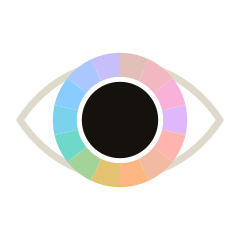
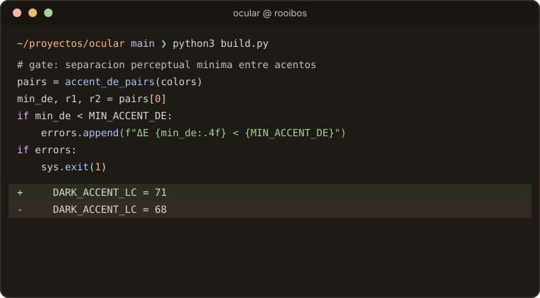
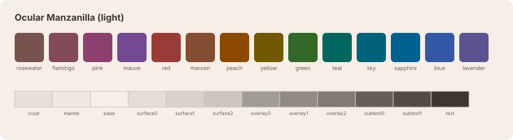
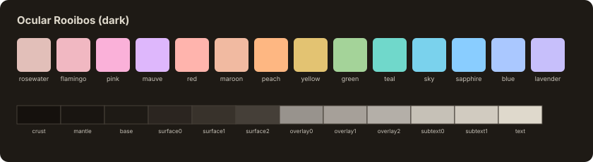
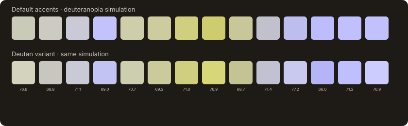
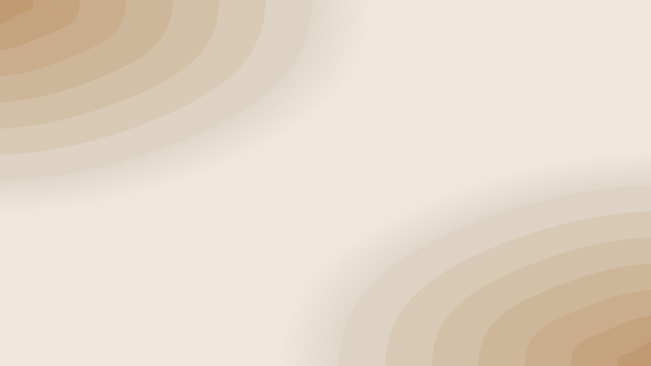
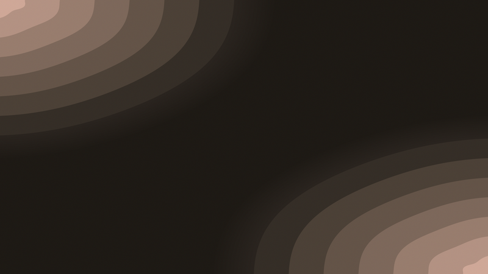

<div align="center">

<picture>
  <source media="(prefers-color-scheme: dark)" srcset="preview/logo-rooibos.svg">
  <source media="(prefers-color-scheme: light)" srcset="preview/logo-manzanilla.svg">
  
</picture>

# Ocular

**A theme that relaxes your eyes — every color set by science, not aesthetics.**

[](LICENSE)
[](https://github.com/Pit-CL/ocular/actions/workflows/verify.yml)
[](SCIENCE.md)
[](#cvd-safe-profile-deutan)

[Palette](#palette) · [Science](#the-science-in-short) · [Ports](#ports-and-switcher) · [CVD](#cvd-safe-profile-deutan) · [Español](README.es.md)

</div>

<br>

<p align="center">
  <picture>
    <source media="(prefers-color-scheme: dark)" srcset="preview/terminal-rooibos.svg">
    <source media="(prefers-color-scheme: light)" srcset="preview/terminal-manzanilla.svg">
    
  </picture>
</p>

Ocular derives every color from OKLCH luminance targets validated with
APCA-W3 contrast — not eyeballed hex codes. It's built on
[Catppuccin](https://github.com/catppuccin/catppuccin)'s role structure, but
each of the 14 accent hues is Ocular's own, optimized by max-min ΔE for
maximum perceptual separation (`derive_hues.py`, see
[SCIENCE.md](SCIENCE.md)).

| Variant | Mode | Character |
|---|---|---|
| **Rooibos** | dark | warm dark background, warm off-white text, accents at Lc 71 |
| **Manzanilla** (chamomile) | light | warm paper, warm ink, accents at Lc 74 |
| **Rooibos Deutan** | dark | same base as Rooibos; the 14 accents get **unequal Lc by design** (~66-77) so deuteranopia/protanopia keep a brightness cue when hue collapses — gate: simulated ΔE ≥ 0.02 (deutan/protan) |
| **Manzanilla Deutan** | light | same base as Manzanilla; accents at unequal Lc (~69-80), same CVD gate |

About the names: Catppuccin names its flavors after coffee drinks (Latte,
Mocha…). Ocular's variants are named after **caffeine-free infusions** instead —
rooibos and chamomile — because this theme is built to relax your eyes, not to
stimulate them.

## Palette

| Manzanilla (light) | Rooibos (dark) |
|---|---|
|  |  |

| Manzanilla Deutan (light) | Rooibos Deutan (dark) |
|---|---|
|  |  |

- [`palette/rooibos.json`](palette/rooibos.json) ·
  [`palette/manzanilla.json`](palette/manzanilla.json) — full Catppuccin roles
  + ANSI16, with the actual Lc of each role in its metadata.
- [`palette/rooibos-deutan.json`](palette/rooibos-deutan.json) ·
  [`palette/manzanilla-deutan.json`](palette/manzanilla-deutan.json) — CVD-safe
  variant (deuteranopia/protanopia simulated with the Viénot, Brettel & Mollon
  matrices), same roles/ANSI16, accents at unequal Lc by design — see
  [SCIENCE.md](SCIENCE.md) for the method and the gate.
- [`palette/VALIDACION.md`](palette/VALIDACION.md) — full validation table.
- Structure is 100% compatible with Catppuccin's roles: any port can be
  adapted by swapping only the hex values.

## Install in 30 seconds

Real, minimal snippets against what `ports/build_ports.py` actually generates
in `ports/out/` — copy, paste, done. For every app at once, use the
[switcher](#ports-and-switcher) instead.

**kitty** (native auto light/dark):

```bash
cp ports/out/kitty/ocular-rooibos.conf ~/.config/kitty/dark-theme.auto.conf
cp ports/out/kitty/ocular-manzanilla.conf ~/.config/kitty/light-theme.auto.conf
```

**ghostty** (native auto light/dark):

```bash
mkdir -p ~/.config/ghostty/themes
cp ports/out/ghostty/ocular-rooibos ports/out/ghostty/ocular-manzanilla ~/.config/ghostty/themes/
echo 'theme = light:ocular-manzanilla,dark:ocular-rooibos' >> ~/.config/ghostty/config
```

**nvim** (`catppuccin/nvim` + `lazy.nvim`; flavour follows `background` on its own):

```bash
cp ports/out/nvim/ocular.lua ~/.config/nvim/lua/plugins/ocular.lua
```

**bat**:

```bash
cp "ports/out/bat/Ocular Rooibos.tmTheme" "$(bat --config-dir)/themes/" && bat cache --build
bat --theme="Ocular Rooibos" some_file.py
```

**delta** (git diff pager):

```bash
mkdir -p ~/.config/delta
cp ports/out/delta/ocular-rooibos.gitconfig ~/.config/delta/ocular.gitconfig
```

```ini
# ~/.gitconfig — add once:
[include]
    path = ~/.config/delta/ocular.gitconfig
```

**VSCode**: download the packaged extension and install it — the 4
variants (Rooibos, Manzanilla, Rooibos Deutan, Manzanilla Deutan) are all
included:

```bash
curl -LO https://raw.githubusercontent.com/Pit-CL/ocular/main/ports/out/vscode/ocular-1.1.0.vsix
code --install-extension ocular-1.1.0.vsix
```

## CVD-safe profile (Deutan)

<p align="center">
  
</p>

Under simulated deuteranopia, the 14 default accents collapse toward a
handful of indistinguishable tones (top row). The **Deutan** variant keeps
them apart by giving each accent an unequal, deliberately-designed Lc — the
numbers under the bottom row are each accent's real Lc against `base`.

`ocular-switch` also reads a **profile** dimension — default or Deutan —
from `~/.config/ocular/profile`. Activate it once:

```bash
echo deutan > ~/.config/ocular/profile    # echo default > ... to go back
```

The next `ocular-switch light|dark` picks it up automatically — no new
flags. An absent, empty, or unreadable file means default; an unrecognized
value falls back to default with a warning.

## The science, in short

1. **Contrast polarity**: 2024-2025 evidence shows that luminance contrast
   matters more than polarity itself, and that the dominant comfort factor is
   the match between screen and ambient light → both modes are first-class
   citizens, designed to switch automatically with the system.
2. **APCA in bands, not maxima**: body text at Lc 82 (dark) / 88 (light);
   secondary text hierarchies in controlled steps. In dark mode we don't chase
   Lc 90: excess brightness feeds halation.
3. **Anti-halation**: never `#000` or `#fff`; the dark background is a warm
   dark gray and text is warm off-white (critical for astigmatism/myopia).
4. **Circadian**: neutrals (~90% of the emissive area) shift warm — less
   energy in the melanopic band (~460-490 nm) at equal perceived luminance.
   Cool accents are preserved: their area is minimal.
5. **Capped chroma** (0.11 dark / 0.13 light, audited post-gamut):
   anti-chromostereopsis, less fatigue from sustained saturation.
6. **Equal-weight accents**: all 14 accents sit at the same Lc — no token
   shouts; luminance reads, hue categorizes.
7. **Own hues, not inherited**: each accent's hue lives inside a name-based
   family window (red = some red, green = some green…) and is optimized by
   deterministic coordinate ascent to maximize the minimum OKLab ΔE between
   the 14 accents — gate `MIN_ACCENT_DE = 0.025` (~2× the OKLab
   just-noticeable-difference), verified in both `build.py` and `audit.py`.
8. **Low-spatial-frequency wallpaper**: wide bands with low local contrast,
   that don't compete for attention with windows.
9. **Complementary typography**: line spacing ≈1.3-1.4× for code, ≈1.5-1.6×
   for prose, familiarity-first font choice — see [SCIENCE.md](SCIENCE.md) §10.

Full detail with sources: [SCIENCE.md](SCIENCE.md).

## Wallpapers

Near-flat background (minimal emission) + symmetric low-spatial-frequency
waves, derived from the same palette. Desktop 3840×2160 · iPhone 1284×2778 ·
iPad 2420×1668.

| Manzanilla (light) | Rooibos (dark) |
|---|---|
|  |  |

Shared across profiles: the neutrals are identical between default and
Deutan, so these wallpapers work for both.

## Usage

```bash
python3 -m venv venv && venv/bin/pip install numpy pillow   # only for wallpapers
python3 build.py        # regenerates the palette and fails if a check doesn't pass
python3 audit.py        # cross-audit text × surface (216 pairs)
venv/bin/python wallpaper.py   # regenerates the 6 wallpapers + previews
```

`build.py` and `audit.py` have no external dependencies (only
`color_science.py`, included).

`derive_hues.py` is a dev-only tool: it optimizes and (re)writes the frozen
hue table `palette/hues.json`. It only needs to run again if the per-role hue
windows change — `build.py` always just reads that table, never the
optimizer.

## Ports and switcher

`ports/build_ports.py` generates ready-to-use themes from the palette JSONs
for: kitty, ghostty, bat (tmTheme), delta (diff backgrounds by role + bat's tmTheme), yazi, lazygit, btop,
tmux, gh-dash, oh-my-posh, nvim (spec for `catppuccin/nvim` with
`color_overrides` and automatic flavour by `background`), VSCode, Chrome (MV3
theme), Slack (custom theme string) and generic shell fragments — all ×2
modes and validated (syntax + palette membership of every hex).

`ports/ocular-switch light|dark` applies the mode across the apps present on
the machine. kitty, ghostty, and nvim get **native switching** (installed
once, then they follow the system appearance on their own); the rest are
re-pointed per mode on every run.

## Status and known limitations

The theme is in real use (terminals, TUIs, editors, and a shadcn/Tailwind web
app all derive from this palette). Honest limitations of the automatic
switch:

- **Long-lived TUIs** (btop, lazygit, gh-dash, yazi) read their config at
  startup: already-open instances don't switch until reopened. btop also
  rewrites its config on exit (an old instance can overwrite the theme; this
  self-corrects on the next switch).
- **Chrome**: themes (`out/chrome/`) load as an unpacked extension and are
  static — switching modes is manual (a platform limitation).
- **Slack**: two custom theme strings (`out/slack/`), manual switch.
- Regeneration is self-contained: the substitution source templates are
  vendored in `ports/reference/` (see [`ports/ATTRIBUTION.md`](ports/ATTRIBUTION.md)),
  so any clean clone can regenerate `ports/out/` without depending on files
  installed outside this repo. CI (`.github/workflows/verify.yml`)
  regenerates the palette and every port on each PR and fails on drift.

## Credits

- **[Catppuccin](https://github.com/catppuccin)** (MIT) — role structure and
  naming; `palette/catppuccin-oficial.json` is an extract of their official
  palette, used by `ports/build_ports.py` as a hex→role map to substitute
  official templates with Ocular's own hues, **and several ports under
  `ports/out/` derive directly from their official ports** (bat, yazi, btop,
  lazygit, among others) with the palette substituted: full detail and
  copyright notice in [`ports/ATTRIBUTION.md`](ports/ATTRIBUTION.md).
- **[Björn Ottosson](https://bottosson.github.io/posts/oklab/)** — the
  OKLab/OKLCH color space.
- **[APCA](https://git.apcacontrast.com/)** (Andrew Somers / Myndex) — the
  APCA-W3 0.1.9 perceptual contrast algorithm, implemented in
  `color_science.py`.

## License

[MIT](LICENSE)
